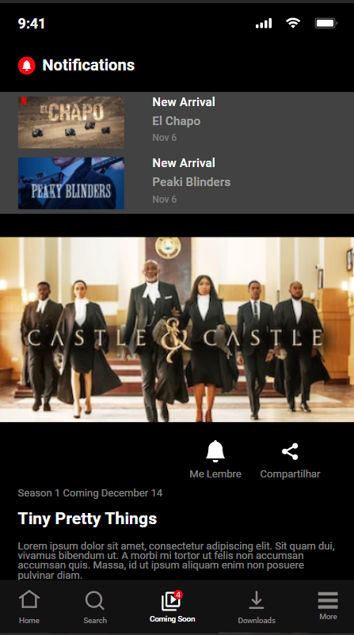

# Maratona Clonando a Netflix

## Desafio Final

### Descrição:

Este desafio foi feito durante um curso da [Maratonas Academy](https://hub.maratonas.academy/), no qual este desafio era clonar o repositório [https://github.com/daniel-bergholz/maratona-clonando-a-netflix](https://github.com/daniel-bergholz/maratona-clonando-a-netflix) e adicionar a página coming soon conforme o protótipo do Figma

## Resultado:

### Também pode ser acessado em: [Coming Soon page](https://guilhermea08.github.io/clonando-a-netflix/coming-soon.html)

## Tecnologias usadas

- Figma
  - Usado como referência para construir a página
- CSS
  - Estilização da página
- HTML
- GIT/GitHub
